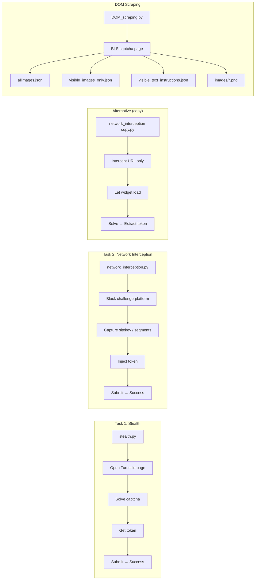

# ABM Job – Captcha & Turnstile Automation

This project contains Python automation scripts for **Task 1 (Stealth Assessment)** and **Task 2 (Network Interception)** using Cloudflare Turnstile, plus a **DOM scraping** script for image-based captcha pages.

---

## Project overview

| Task | Purpose |
|------|--------|
| **Task 1** | Automate Turnstile verification (headless and headed), extract token, measure success rate. |
| **Task 2** | Block the Turnstile widget from loading, capture request details (sitekey, etc.), inject a token, submit, and show success. |
| **DOM scraping** | Scrape captcha images and visible text from a different captcha demo page. |

---

## Approach

- **Task 1 (Stealth):** Use SeleniumBase with undetected Chrome (`uc=True`) to avoid bot detection. Rely on its built-in `solve_captcha()` for Turnstile, then read the token from the hidden `cf-turnstile-response` input. Run in both headed and headless modes to measure success rate (e.g. 10 retries, target ≥60%).
- **Task 2 (Network Interception):** Use Playwright’s `page.route("**/*", handler)` to intercept requests. Abort only `cdn-cgi/challenge-platform` so the Turnstile widget never loads (no iframe). Parse the aborted request URL for sitekey and path segments (pageaction, cdata, pagedata). Inject a pre-obtained token into the same hidden input the real widget would use, then submit the form so the page shows “Success! Verified” without ever loading the challenge.
- **Alternative script:** Same page and routing, but do not abort—only log request details. Let the widget load and the user (or solver) complete it, then extract the token from the DOM for inspection or reuse.
- **DOM scraping:** Use Selenium to load a BLS image-captcha page (full JS rendering), then BeautifulSoup on `page_source` to collect all images and text. Use Selenium again to filter by visibility (computed style, size) and save only the visible captcha grid images and instruction text to JSON and PNG for downstream use.

---

## File structure and diagram

```
ABM Job/
├── README.md                    # This file – project documentation
├── stealth.py                   # Task 1: Turnstile automation (SeleniumBase)
├── network_interception.py      # Task 2: Block widget + inject token (Playwright)
├── network_interception copy.py # Alternative: intercept & extract token (no abort)
└── DOM_scraping.py              # Scrape captcha images & text from BLS page
```

### Workflow diagram

The diagram below shows how the main scripts relate and what they do.



- **Task 1**: Run `stealth.py` → browser opens Turnstile page, solves captcha, gets token, submits, prints token and success.
- **Task 2**: Run `network_interception.py` → Turnstile widget is blocked, details captured, token injected, submit shows “Success! Verified”.
- **Alternative**: `network_interception copy.py` does not block the widget; it intercepts the request to log details, then lets the user solve and extracts the token.
- **DOM scraping**: `DOM_scraping.py` goes to a different URL, scrapes all/visible images and text, and writes JSON + PNG files.

---

## File-by-file description

### 1. `README.md`

This file. It explains the project, each script, how to run them, and the workflow (including the diagram above).

---

### 2. `stealth.py`

**Role:** Task 1 – **Stealth assessment** (Turnstile automation).

**What it does:**

- Uses **SeleniumBase** with `uc=True` (undetected Chrome).
- Opens `https://cd.captchaaiplus.com/turnstile.html`.
- Runs twice: once with `headless=False`, once with `headless=True`.
- Calls `sb.solve_captcha()` to solve the Turnstile challenge.
- Reads the Turnstile token from `input[name='cf-turnstile-response']`.
- Clicks submit and waits for the result.

**Dependencies:** `seleniumbase`

**How to run:**

```bash
python stealth.py
```

**Note:** Task 1 also required 10 retries and a success rate of at least 60%; that logic can be added around this script if needed.

---

### 3. `network_interception.py`

**Role:** Task 2 – **Network interception**: block Turnstile from loading, capture details, inject token, submit, show success.

**What it does:**

1. Launches Chromium via **Playwright** (optional `--headless`).
2. Registers a route handler on `**/*`:
   - For URLs containing `cdn-cgi/challenge-platform`, it **aborts** the request and records:
     - **Sitekey** (segment matching `0x...`).
     - **Segments**: full URL path segments (pageaction, cdata, pagedata, etc.).
   - All other requests continue normally.
3. Opens the Turnstile page → widget does **not** load (iframe absent).
4. If `--token` is provided:
   - Ensures the hidden input `input[name="cf-turnstile-response"]` exists (from the page’s script).
   - Injects the given token into that input.
   - Clicks the submit button.
   - Waits for `#result`, reads its text, and prints it (e.g. “Success! Verified”).
   - Keeps the browser open briefly so you can see the result.

**Dependencies:** `playwright`

**How to run:**

```bash
# With a token (from Task 1 or any valid token)
python network_interception.py --token YOUR_TOKEN

# With a dummy token (verification may still show success if endpoint is mocked)
python network_interception.py --token dummy_token

# Headless
python network_interception.py --token YOUR_TOKEN --headless
```

**Output:** Prints whether the iframe is present (`False` when blocked), captured details (sitekey, segments), and the result message. Optionally can save a screenshot (e.g. `turnstile_success.png`) if that code is present.

---

### 4. `network_interception copy.py`

**Role:** **Alternative** Task 2 approach – intercept and **log** Turnstile request details without blocking; then solve and **extract** the token.

**What it does:**

1. Uses Playwright to open the same Turnstile URL.
2. Route handler **does not abort**; it only **logs** when a request contains `challenge-platform`:
   - Parses URL for `sitekey` (`0x...`), `pageaction`, `cdata`, `pagedata` via regex.
   - Prints these parameters.
3. Lets the page and Turnstile widget load normally.
4. Waits until the hidden input `cf-turnstile-response` has a value (user/solver completes captcha).
5. Reads the token with `eval_on_selector`, prints it, clicks submit, and prints the `#result` text.

**Difference from `network_interception.py`:**  
Here the widget **loads** and the user/solver completes it; the script only **captures** the request details and the **resulting token**. In `network_interception.py`, the widget is **blocked** and a token is **injected**.

**Dependencies:** `playwright`

**How to run:**

```bash
python "network_interception copy.py"
```

---

### 5. `DOM_scraping.py`

**Role:** **DOM scraping** of a **different** captcha page (BLS-style image captcha), not Turnstile.

**What it does:**

1. Uses **Selenium** (Chrome) and **BeautifulSoup**.
2. Opens:  
   `https://egypt.blsspainglobal.com/Global/CaptchaPublic/GenerateCaptcha?data=...`
3. **All images:** Finds all `` tags; for those with `data:image/` in `src`, saves index, alt, src, type into `allimages.json`.
4. **Visible captcha images only:** Finds `img.captcha-img`, filters by visibility (display, visibility, opacity, size), keeps first 9 visible:
   - Appends same metadata to `visible_images_only.json`.
   - Decodes base64 and saves each as `images/captcha_visible_0.png` … `captcha_visible_8.png`.
5. **Text:** Collects page title, all stripped text, and instruction-like strings (e.g. containing “select”, “click”, “please”, “box”, “number”, “image”) into `visible_text_instructions.json`.

**Dependencies:** `requests`, `beautifulsoup4`, `selenium`

**Output files:**

| File | Description |
|------|-------------|
| `allimages.json` | All images (with data-URL src) from the page. |
| `visible_images_only.json` | Only the visible captcha grid images (up to 9). |
| `visible_text_instructions.json` | Page title, all text, and instruction-like lines. |
| `images/captcha_visible_0.png` … `captcha_visible_8.png` | Decoded visible captcha images. |

**How to run:**

```bash
python DOM_scraping.py
```

Requires Chrome and ChromeDriver (or Selenium 4 + built-in driver). Creates `images/` if missing.

---

## Diagram summary

- The **flowchart** in the “Workflow diagram” section summarizes:
  - **Task 1:** `stealth.py` → open page → solve → get token → submit → success.
  - **Task 2:** `network_interception.py` → block widget → capture details → inject token → submit → success.
  - **Alternative:** `network_interception copy.py` → intercept (no block) → widget loads → solve → extract token.
  - **DOM scraping:** `DOM_scraping.py` → BLS page → JSON files + `images/*.png`.

There are **no separate diagram image files** in the repo; the only diagram is the **Mermaid flowchart** in this README. Rendered in a viewer that supports Mermaid (e.g. GitHub, many Markdown editors), it shows how each file fits into the project.

---

## Requirements

- **Python 3**
- **stealth.py:** `seleniumbase`
- **network_interception.py** / **network_interception copy.py:** `playwright` (and `playwright install chromium` if needed)
- **DOM_scraping.py:** `requests`, `beautifulsoup4`, `selenium`, Chrome/ChromeDriver

---

## Quick start

```bash
# Task 1 – solve Turnstile and get token
python stealth.py

# Task 2 – block widget, inject token, see success
python network_interception.py --token YOUR_TOKEN

# Alternative – intercept and extract token after solving
python "network_interception copy.py"

# DOM scraping – BLS captcha images and text
python DOM_scraping.py
```

---

## Publish to GitHub

1. **Create a new repository** on [GitHub](https://github.com/new):
   - Name: e.g. `abm-job-captcha` (or any name you prefer)
   - Visibility: **Public**
   - Do **not** add a README, .gitignore, or license (this project already has them)

2. **Push this folder** (run from the project directory):

   ```bash
   cd "c:\Users\amora\Desktop\road to be good\Projects\ABM Job"
   git remote add origin https://github.com/YOUR_USERNAME/abm-job-captcha.git
   git branch -M main
   git push -u origin main
   ```

   Replace `YOUR_USERNAME` and `abm-job-captcha` with your GitHub username and repo name.

3. Optional: install [GitHub CLI](https://cli.github.com/) and run:
   ```bash
   gh repo create abm-job-captcha --public --source=. --push
   ```

---

## License and use

Use for learning and assessment only. Respect the target sites’ terms of service and robots.txt.
